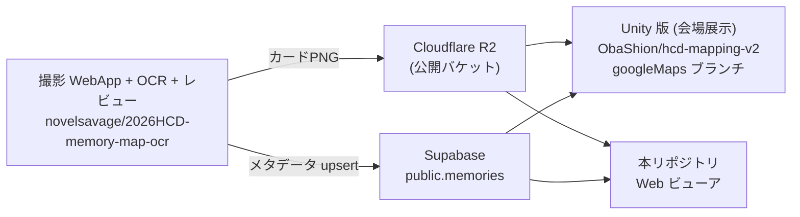

# 思い出マップ 2026 Web ビューア 設計書

AI エージェント・後続開発者向けの詳細設計ドキュメント。
広域マップ化の構想は [docs/wide-area-map-plan.md](docs/wide-area-map-plan.md)、
PLATEAU 活用と OSM 貢献は [docs/plateau-osm-plan.md](docs/plateau-osm-plan.md) を参照。

---

## 1. 目的と位置づけ

麗澤大学ホームカミングデー 2026「思い出マップ」（2026-06-13 実施）で収集した
手書き付箋の思い出を、**イベント後もブラウザだけで閲覧できる 3D サイト**として提供する。
Unity 版（会場展示用）の演出を Web に移植したもの。

### エコシステム内での位置



- 本サイトは**読み取り専用**。書き込みは一切しない
- Unity 版のスクリプト（`Assets/ReitakuMap/Scripts/`）が演出の原典。
  特に `MemoryGeoProjector.cs`（座標投影）と `MemoryMarker.cs`（ビルボード）は
  本実装が挙動を踏襲している

## 2. 技術スタック

| 領域 | 採用技術 | 選定理由 |
|---|---|---|
| ビルド | Vite 8 + TypeScript（strict） | 静的サイトで完結、デプロイが最軽量 |
| 3D | Three.js（vanilla、R3F不使用） | 演出の自由度優先。チームのReact知識がなくても追える |
| ポストプロセス | EffectComposer + UnrealBloomPass | 発光演出（Unity 版の Bloom 相当） |
| UI | 素の DOM + CSS（フレームワーク無し） | HUD 程度なので依存を増やさない |
| デバッグ | lil-gui（`?debug=1` 時のみ動的 import） | キャリブレーション作業用 |
| データ | Supabase PostgREST（fetch 直叩き） | supabase-js を入れるほどの用途がない |

## 3. ディレクトリ構成

```
├── index.html            # HUD の DOM / 全 CSS / フォント読込（エントリ）
├── vite.config.ts        # base:'./'（サブパス配信対応）
├── public/
│   ├── models/campus.glb # キャンパス3Dモデル（生成物。§9 参照）
│   ├── draco/            # Draco デコーダ（node_modules から複製した生成物）
│   └── demo-memories.json# フォールバック用の架空デモデータ 18 件
└── src/
    ├── main.ts           # 起動シーケンス・メインループ・クリック処理・debug GUI
    ├── config.ts         # ★調整値の集約地。キャリブレーション/色/マーカー寸法
    ├── scene.ts          # renderer/camera/controls/ライト/グリッド/bloom
    ├── campus.ts         # GLB 読込・表示モード切替・地面スナップ raycast
    ├── surroundings.ts   # OSM 周辺市街地の生成（§9.5）
    ├── geo.ts            # 緯度経度 → ワールド座標投影
    ├── data.ts           # Supabase 取得 + デモ JSON フォールバック
    ├── cards.ts          # 思い出マーカー（ピン+テキスト）の生成・アニメ・フィルター
    ├── textLabel.ts      # memory_text の Canvas テクスチャ生成
    ├── tour.ts           # 自動オービットツアー（アイドル検知）
    └── ui.ts             # HUD（チップ・詳細パネル・件数・トースト）
```

依存方向は `main.ts` → 各モジュール の一方向。モジュール間の相互依存は
`config.ts` / `data.ts`（型）経由のみ。

## 4. 起動シーケンス

```
main()
 ├─ createSceneContext()        … WebGL 初期化（同期）
 ├─ Promise.all([
 │    loadCampusModel(),        … GLB 7.7MB + Draco デコード（進捗をローディングUIへ）
 │    loadMemories()            … Supabase or デモJSON
 │  ])
 ├─ markers.spawn(mapMemories, snapToGround) … 投影 + 地面レイキャスト + テキストピン
 ├─ ui.buildFilters()           … データに実在するジャンル/年代からチップ生成
 └─ animate()                   … rAF ループ開始
```

ローディングオーバーレイはモデル・データ両方の完了で消える。
どちらかが失敗した場合はローディング画面にエラーメッセージを表示（`main().catch`）。

## 5. データモデル

### Supabase `public.memories`（読み取りビュー）

DDL の原典: OCR リポジトリ `Codex-docs/supabase-memories.sql`

| カラム | 型 | 本サイトでの扱い |
|---|---|---|
| `id` | text PK（例 `HCD-20260613-141847-A9UJ`） | マーカー識別・フォーカス対象特定 |
| `status` | `published` / `hidden` | **RLS により anon には published しか返らない**（クエリでも明示フィルタ） |
| `memory_text` | text | 3D テキストラベル・詳細パネル本文 |
| `nickname` | text | 詳細パネル署名 |
| `genre` | text スラッグ（enum ではない） | 色分け・フィルター。未知の値は `GENRE_FALLBACK_COLOR` |
| `era` | text（例 `1980年代`。enum ではない） | フィルター。null は「全年代選択時のみ表示」 |
| `latitude` / `longitude` | double | §6 の投影に使用。null または `MAP_BOUNDS` 外は非表示 |
| `card_url` | text（R2 公開 PNG） | **本サイト 3D では未使用**（OCR パイプライン互換のため DB に残存） |
| `reitaku_dummy` | boolean | **true=大学内 / false=大学外**。名前に反して「ダミーデータ」の意味では無い点に注意 |

取得クエリ（`data.ts`）:

```
GET {SUPABASE_URL}/rest/v1/memories
    ?select=*&status=eq.published&event_id=eq.{EVENT_ID}
    &order=captured_at.asc.nullslast
headers: apikey / Authorization: Bearer {anon key}
```

### ジャンル配色（変更禁止 — OCR 側 `capture-form.tsx` と同期）

恋愛 `#ec9bb6` / 友情 `#86c5e0` / 学業 `#83cf8a` / 部活 `#f0cf57` /
行事 `#b9a3e3` / 上記以外 `#357a5a`

## 6. 座標系と投影（geo.ts）

Unity 版 `MemoryGeoProjector.cs` の正距円筒近似の移植。

```
east  = Δlon(rad) × cos(originLat) × 6378137
north = Δlat(rad) × 6378137
→ yaw 回転 → x = east × unitsPerMeter,  z = −north × unitsPerMeter（右手系）
```

- 原点 `(35.833956, 139.956178)` ＝キャンパス中央付近 ＝ Unity 版と同一値
- **1 unit ≒ 1 m**（モデルがメートルスケールなので `unitsPerMeter: 1`）
- Three.js は右手系のため北を **−Z** に取る（Unity は左手系で北=+Z）。
  逆向きに出る場合は `invertEastWest` / `invertNorthSouth` で補正
- キャンパス規模（±数百 m）での近似誤差は数 cm オーダーで無視できる
- 接地判定は `MAP_BOUNDS` の矩形内かどうかで行う（cards.ts）。
  `maxDistanceFromOriginMeters` は現在未使用（Unity 版由来の名残）

### キャリブレーション運用

モデルと実座標のズレ調整は実測でしか合わせられない。手順:

1. `?debug=1` で開く（軸・原点マーカー・lil-gui が出る）
2. 実在の場所が分かる思い出（またはデモデータ）を目印に
   `CALIBRATION`（yaw/offset/scale）と `MODEL_TRANSFORM` を GUI で調整
3. 「設定を console に出力」→ 出た JSON を `src/config.ts` に書き戻す
4. Geo 系の変更はマーカー再配置が必要なので**リロードして確認**

> 2026-07-05 に手動合わせを実施。`MODEL_TRANSFORM` は
> scale 3.51 / offset (−409, −30.2, 280)。Geo 側は unitsPerMeter 1 /
> yaw 0 / offset (0, 0) のまま。本番データ投入後に最終確認する。

## 7. 3D シーン構成（scene.ts）

```
Scene
├─ HemisphereLight / DirectionalLight   … holo モードの MeshStandardMaterial 用
│                                          （テクスチャモードは unlit なので無影響）
├─ GridHelper 1600×80                    … 床グリッド（green, opacity 0.28）
├─ Mesh(Plane1300 + RadialGradient)      … 中心の淡い発光サークル（Additive）
├─ Group "campus"                        … §9
└─ Group (MemoryMarkers.group)           … §8
```

### レンダリングパイプライン

`RenderPass → UnrealBloomPass(strength 0.85, radius 0.6, threshold 1.0) → OutputPass`

**bloom threshold=1.0 が設計上のポイント**:
通常マテリアル（白いカード等）は輝度 1.0 を超えないため光らず、
Additive blending の重なりで 1.0 を超える部分（holo のワイヤーフレーム、発光サークル）
だけがブルームする。閾値を下げるとカードが白飛びする（開発中に実際に起きた）。

- トーンマッピング: ACESFilmic, exposure 1.1
- カメラ: fov55, near0.5, far6000。OrbitControls は
  `maxPolarAngle 0.49π`（地面下に潜らない）, distance 15–1200

## 8. 思い出マーカー（cards.ts / textLabel.ts）

Unity googleMaps ブランチの `Pin.prefab`（PinPole + PinText、`downloadImages: 0`）相当。

### 構造（1 件あたり）

```
Group (root)  ← 位置・出現スケール
├─ Cylinder(pole)  … ジャンル色、接地点からラベルまで
├─ Sphere(pin)     … ジャンル色、接地点
└─ Plane "label"   … Canvas テクスチャ（memory_text）。毎フレーム camera.quaternion をコピー
```

- **ビルボードは label メッシュのみ回転**させ、root/pole は傾けない
  （Unity 版 `MemoryMarker.LateUpdate` と同じ手法）
- 配置判定: 座標が `MAP_BOUNDS` 内のみ spawn。範囲外・座標なしは**非表示**
- 孤立時のラベルは `defaultLabelHeight`。密集時は `groundOffsetY` の安全高度まで
  下方向へ積み、それ以上は標準高度より上へ積む
- Plane の Pivot は左上。ポール上端を通る位置から、左揃えの文字面が右下へ広がる
- 出現アニメ: `MARKER.appearDuration`（1.2s）+ stagger 0.15s（最大 3s）。
  easeOutBack スケール + opacity フェード
- ピッキング: pointerup 時に移動量 6px / 押下 400ms 以内なら Raycaster で label 判定

### テキストラベル（textLabel.ts）

- `memory_text` を Noto Serif JP で Canvas 描画 → `CanvasTexture`
- 明示的な改行を保持し、Canvas 幅を超える行は文字単位で自動改行
- 半透明ダーク背景 + ジャンル色左ボーダー、最大 5 行で省略
- `card_url` は参照しない

## 9. キャンパスモデル（campus.ts）

- `public/models/campus.glb`（7.7MB）は **生成物。直接編集しない**
- 出典: Unity リポジトリ `Assets/ReitakuMap/Models/Re_map02.glb`（37MB）
  ＝ Google Earth Photorealistic 3D Tiles を Blender（Blosm 等）で切り出した
  **テクスチャ焼き込み unlit モデル**（`KHR_materials_unlit`、941k 頂点、262 プリミティブ）
  ＝ メンバー共有の `Re_mapblend.glb` と同一ファイル
- 再生成: `npx @gltf-transform/cli optimize <src>.glb public/models/campus.glb --compress draco --texture-compress webp --texture-size 1024`
- Draco デコーダは `public/draco/` に同梱
  （`node_modules/three/examples/jsm/libs/draco/gltf/` の複製）

### 表示モード

| モード | 条件 | 実装 |
|---|---|---|
| テクスチャ（既定） | — | 元マテリアルのまま。夜に馴染ませるため `color×0.88`、anisotropy 8 |
| ホログラム | `?holo` | 全メッシュを暗緑 Standard に差替え + 同ジオメトリの Additive ワイヤーフレームを重ねる |

- unlit（MeshBasicMaterial）なのでライティング不要・負荷も低い
- bbox 中心が原点から `autoCenterThreshold(2000)` を超えた場合のみ自動中央寄せ
  （通常は発動しない。発動したら console に警告）

## 9.5 周辺市街地（surroundings.ts / scripts/fetch-osm.mjs）

広域マップ化プラン（docs/wide-area-map-plan.md）の **Phase 2（案D）実装**。

- 範囲: OCR WebApp `capture-form.tsx` の `MAP_BOUNDS` を基準に、
  東側だけ 139.972 まで拡張（新柏駅 35.8385/139.96665 を含めるため）。
  南柏・新柏の両駅に光柱 + 駅名ラベルが立つ。
  ※マーカー表示範囲の `MAP_BOUNDS`（config.ts）は OCR 範囲のまま
- データ: `scripts/fetch-osm.mjs` を手動実行 → Overpass API から
  建物・道路・鉄道・駅を取得 → `public/osm-surroundings.json`（857KB / gzip 177KB）
  に保存。**生成物なので直接編集しない**。範囲を変えたらスクリプトを再実行
- 描画: 建物は ExtrudeGeometry を mergeGeometries で 1 メッシュに統合し、
  「ほぼ黒の塗り（遮蔽用）+ EdgesGeometry の加算合成グリーン線」の 2 層。
  **エッジ線は常に 1px 幅なので、遠景では 1 ピクセルに複数の線が加算されて
  飽和し「明るい塊のムラ」になる**。対策として edge opacity 0.2 + フォグ
  (FogExp2 0.0008) の距離減衰で抑えている。さらに調整する場合はこの 2 値を触る。
  道路/鉄道は LineSegments、駅は光柱 + DotGothic16 の Sprite ラベル
- キャンパスモデルとの重複除外は「bbox 矩形内 かつ モデルへの下向きレイキャストが
  ヒット」する建物のみスキップ。矩形だけで判定すると不定形モデルとの差の帯が
  建物ゼロの空白になる（実際に起きた不具合）
- 台地プレーンと建物の基準高は、変換後キャンパスモデルの bbox 底面 +
  `SURROUNDINGS.baseOffsetFromCampusMin (-0.3)` から求める。固定Y座標だと、
  モデルを上下した際に不透明の台地面へ埋没するためである
- 建物屋上・台地面はマーカーの接地 raycast 対象に含まれる
- `?nocity` で無効化
- **ライセンス**: ODbL。「© OpenStreetMap contributors」表示が必須
  （画面右下 + README に記載済み）

### マーカー表示ルール（cards.ts）

**座標が `MAP_BOUNDS` 内ならピン+テキストで接地**（`reitaku_dummy` に依存しない）。
範囲外・座標なしは非表示。

## 10. UI・テーマ（index.html / ui.ts）

- **フォント**: Bitcount（見出し・数字）+ DotGothic16（UI 全体）。
  OCR 側撮影 WebApp `layout.tsx` と同一。Google Fonts CDN から読込
- **配色**: ダーク `#050d08` + グリーンアクセント `#4ade80`。
  CSS 変数（`:root`）に集約。ジャンル 6 色だけは仕様（§5）なので触らない
- フィルターチップ: 全選択状態で 1 つクリック→単独選択、以降トグル、
  0 件になったら全選択へ戻る（`ui.ts toggleSet`）
- 詳細パネル: 右スライドイン（ジャンル・年代・本文・ニックネーム）。クリックでカメラも対象へ lerp フォーカス
  （`main.ts` の `focusing` 状態。操作すると即解除）
- 自動ツアー（tour.ts）: 40 秒無操作で水平オービット開始。
  pointerdown/wheel/keydown/touchstart で解除。ボタンで手動トグルも可
- コンパス（右下）: 毎フレーム `controls.getAzimuthalAngle()` を CSS rotate に
  反映（回転方向は +azimuth。カメラが東に居ると N は画面右）。
  クリックで Spherical.theta=0 にして北向きへリセット

## 11. URL パラメータ

| パラメータ | 効果 |
|---|---|
| `?demo=1` | Supabase を無視してデモデータ表示 |
| `?debug=1` | キャリブレーション GUI + 軸 + 原点マーカー |
| `?holo` | ホログラム（ワイヤーフレーム）表示 |

## 12. 環境変数・ビルド・デプロイ

- `.env`（gitignore 済み）: `VITE_SUPABASE_URL` / `VITE_SUPABASE_ANON_KEY` / `VITE_EVENT_ID`
- **未設定でもデモデータで動くのが正常仕様**（起動時トーストで通知）
- anon キーは RLS 前提の公開可能キーだが、ビルド成果物に埋め込まれる点は認識しておく
- `npm run build` = `tsc --noEmit && vite build`。これが CI 相当の検証
- 配信: `dist/` を任意の静的ホスティングへ。`base:'./'` なのでサブパスでも動く

## 13. 既知の課題 / TODO

- [ ] 座標キャリブレーションの最終確認（§6。手動調整値は反映済み、実データ投入後に要確認）
- [ ] Supabase 接続情報が未設定（森さんの Supabase プロジェクトから取得）
- [ ] マーカー数百件超でのパフォーマンス未検証
      （Canvas テクスチャ数に応じて troika-three-text / アトラス化を検討）
- [ ] モバイル実機での操作性・負荷未検証
- [ ] Google 3D Tiles 由来モデルの再配布に関する規約リスク
      （docs/wide-area-map-plan.md §ライセンス参照）
- [x] 広域マップ化 Phase 2（OSM スタイライズド周辺市街地）実装済み。Phase 3（ストリーミング）は未着手

## 14. 関連リソース

- OCR/配信: https://github.com/novelsavage/2026HCD-memory-map-ocr
- Unity 版: https://github.com/ObaShion/hcd-mapping-v2 （googleMaps ブランチ。
  Cesium 実験は feature/kashiwa-cesium-scene ブランチ）
- Slack: reitakuuengineering.slack.com `#1-class-思いだしマップ-yoh-2026`
- R2 公開バケット: `pub-6a157761d4194034a8b2b70f9e7a2bad.r2.dev`
